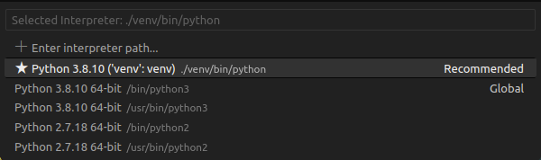

## Projeto criado usando venv

#### Execute o comando abaixo para criar uma enviroment
```
python3 -m venv venv
```

#### Execute o comando para ativar o ambiente
```
source ./venv/bin/activate
```

#### Execute o comando para instalar todos os pacotes necessários para execução do projeto
```
pip install -r requirements.txt
```

Obs: Selecione o interpretador no vscode:




#### Execute o comando para iniciar o projeto
```
python __init__.py
```
ou
```
python helloworld.py
```